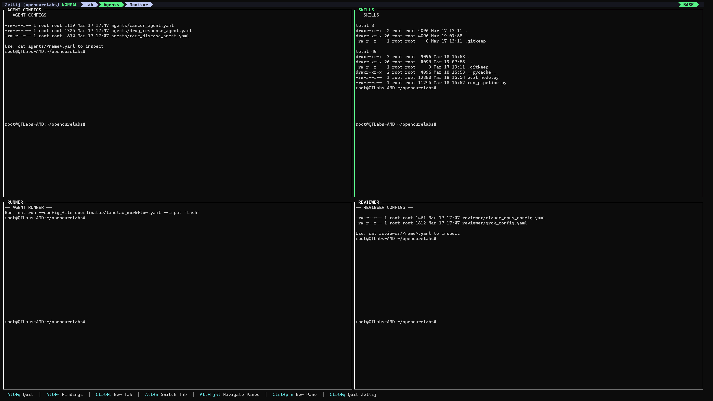
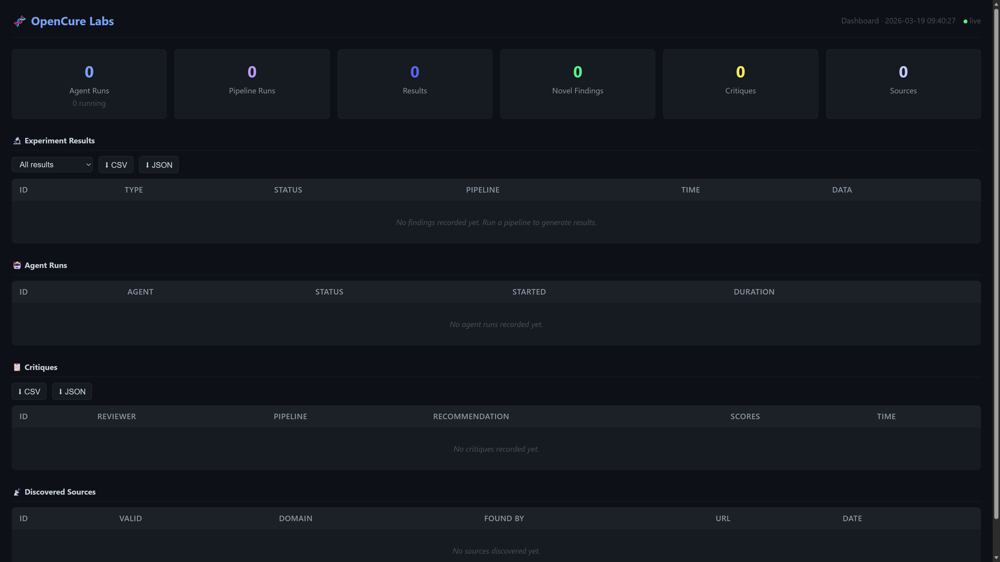

<p align="center">
  <picture>
    <source media="(prefers-color-scheme: dark)" srcset="logos/OpenCure%20Labs%20Inverted%20Color%20Transparent%20bg.svg">
    <source media="(prefers-color-scheme: light)" srcset="logos/OpenCure%20Labs%20Main%20Logo%20Transparent%20bg.svg">
    
  </picture>
  <br><br>
  <a href="https://github.com/OpenCureLabs/OpenCureLabs/actions/workflows/ci.yml"></a>
  <a href="https://opencurelabs.ai"></a>
</p>

**Autonomous AI agents for computational biology — open tools, public artifacts, and reproducible.**

> **🔬 Browse open research artifacts → [opencurelabs.ai](https://opencurelabs.ai)**

---

## Table of Contents

- [Overview](#overview)
- [Architecture](#architecture)
- [Data Sources](#data-sources)
- [Agent Layer](#agent-layer)
- [Compute Infrastructure](#compute-infrastructure)
- [Reviewer Agents](#reviewer-agents)
- [Outputs & Publishing](#outputs--publishing)
- [Global Dataset](#global-dataset)
- [Distributed Computing](#distributed-computing)
- [My Data / Solo Mode](#my-data--solo-mode)
- [Dashboard & Monitoring](#dashboard--monitoring)
- [Scientific Capabilities](#scientific-capabilities)
- [Roadmap](#roadmap)
- [Philosophy](#philosophy)
- [Getting Started](#getting-started)
- [Contributing](#contributing)

See also: **[CONTRIBUTING.md](CONTRIBUTING.md)** — full guide for researchers and developers.

---

## Overview

OpenCure Labs is open infrastructure for computational biology, with a long-term goal of enabling more open and accessible personalized medicine workflows.

The platform runs **agents that coordinate, critique, and iterate** — analyzing genomics data, predicting protein structures, running docking simulations, and publishing structured artifacts with provenance metadata. A Cloudflare D1 task queue coordinates shared work; results are signed by the contributing system and stored in R2.

OpenCure Labs supports both **shared and private usage**. In the default mode, results are published to a public dataset at **[opencurelabs.ai](https://opencurelabs.ai)** — researchers anywhere can browse artifacts, download raw result objects, and build on what the agents produce. In [solo mode](#my-data--solo-mode), users run the same pipelines locally on their own data with no external calls.

---

## Architecture

```
 ┌─────────────────────────────────────────────────────────────────────┐
 │                        DATA LAYER                                    │
 │  ┌──────────────┐  ┌───────────────┐  ┌──────────────┐             │
 │  │  TCGA / GEO  │  │ ClinVar / OMIM│  │   ChEMBL     │  + more ──► │
 │  │Cancer genomics│  │ Rare variants │  │Drug bioact.  │  (see below)│
 │  └──────┬───────┘  └──────┬────────┘  └──────┬───────┘             │
 └─────────┼─────────────────┼─────────────────-┼─────────────────────┘
           │                 │                   │
           └─────────────────┼───────────────────┘
                             │        ▲
                             │        │ new datasets
                             │        │ discovered
                             ▼        │
 ┌───────────────────────────────────────────────────────────────────┐
 │        Agent Coordinator — NemoClaw / LabClaw                      │
 │        Powered by NVIDIA NeMo Agent Toolkit (AgentIQ)              │
 │   Routes tasks · calls skills · enforces guardrails · publishes    │
 │   YAML-configured · nat CLI · Gemini API · telemetry               │
 └──────────────────────────┬────────────────────────────────────────┘
                 ┌───────────┼─────────────┐
                 ▼           ▼             ▼
          ┌─────────┐  ┌──────────┐  ┌───────────┐
          │ Cancer  │  │   Rare   │  │   Drug    │
          │  Agent  │  │ Disease  │  │ Response  │
          │ Tumor   │  │ Variant  │  │ QSAR +    │
          │Immunol. │  │ Analysis │  │  Docking  │
          └────┬────┘  └──────────┘  └─────┬─────┘
               │                           │
               ▼                           ▼
        ┌────────────┐             ┌─────────────┐
        │ Local RTX  │             │  Vast.ai    │
        │   5070     │             │   Burst     │
        │ Genomics,  │             │  Heavy ML   │
        │ Structure  │             │    Jobs     │
        └─────┬──────┘             └──────┬──────┘
              │                           │
              ▼                           ▼
        ┌──────────────────────────────────────────────────────┐
        │  Grok (VM resident) — grok-cli / xAI API             │
        │  ┌───────────────────────┐ ┌────────────────────────┐│
        │  │ Reviewer roles:       │ │ Researcher role:       ││
        │  │ · Scientific critique │ │ · Hunt new datasets    ││
        │  │   (logic, stats, JSON)│ │ · Scrape bioRxiv/EBI   ││
        │  │ · Tier 1: local review│ │ · Monitor ClinTrials   ││
        │  │   at submission time  │ │ · Find GEO accessions  ││
        │  │ · Tier 2: sweep       │ │ · DeepSearch (xAI)     ││
        │  │   verification batch  │ │ · Execute bash on VM   ││
        │  └───────────────────────┘ └────────────────────────┘│
        └──────────────────────────┬───────────────────────────┘
                                   │
                              │
              ┌───────────────┼───────────────┐
              ▼               ▼               ▼
         ┌────────┐     ┌──────────┐    ┌───────────────────────┐
         │ GitHub │     │   PDF    │    │ R2 / opencurelabs.ai  │
         │Pipelines│    │ Reports  │    │   Global Dataset      │
         │ + code │     │ (local)  │    │ pub.opencurelabs.ai   │
         └────────┘     └──────────┘    └───────────────────────┘
```

---

## Data Sources

OpenCure Labs ingests data from three primary scientific repositories — plus a continuously expanding pool of sources discovered autonomously by the Grok researcher agent:

### Pre-configured Sources

| Source | Domain | Description |
|---|---|---|
| **TCGA / GEO** | Cancer Genomics | Tumor sequencing data, expression profiles, somatic mutation datasets |
| **ClinVar / OMIM** | Rare Variants | Clinically curated variant classifications, gene-disease associations |
| **ChEMBL** | Drug Bioactivity | Compound bioactivity data, binding affinities, pharmacological annotations |

### Grok-Discovered Sources (dynamic)

Grok runs continuously on the VM and surfaces new data sources the system hasn't seen before. Confirmed candidates include:

| Source | Domain | How Grok finds it |
|---|---|---|
| **bioRxiv / medRxiv** | Preprints | DeepSearch + xAI web access |
| **EBI / UniProt** | Protein / variant | Structured API queries from VM |
| **ClinicalTrials.gov** | Trial data | Monitoring new registrations |
| **GEO new accessions** | Expression datasets | Watching release feeds |
| **PubChem** | Compound data | Expanding ChEMBL hits |
| **OpenTargets** | Gene-disease links | Cross-referencing ClinVar findings |
| **Zenodo / Figshare** | Open science data | Surfacing curated community datasets |

All discovered sources are registered with the coordinator for validation and routing before ingestion.

---

---

## Agent Layer

### Coordinator — NemoClaw / LabClaw

Built on the **[NVIDIA NeMo Agent Toolkit](https://github.com/NVIDIA/NeMo-Agent-Toolkit)** (AgentIQ), the coordinator is defined in YAML and orchestrated via the `nat` CLI. NeMo manages the agent lifecycle — workflow definition, evaluation, telemetry, and hyperparameter tuning. Coordinator reasoning currently runs on the **Google Gemini API** (`gemini-2.5-flash-lite`) via NeMo's OpenAI-compatible LLM adapter, which keeps the local RTX 5070 free for scientific compute (structure prediction, docking, ML). NVIDIA NIM endpoints are supported by the toolkit and can be swapped in for self-hosted deployments — see [LABCLAW.md](LABCLAW.md) for the LLM options table.

The coordinator is responsible for:

- **Task routing** — dispatching jobs to the correct domain agent based on input type and objective
- **Skill invocation** — calling specific scientific skill modules (e.g., structure prediction, neoantigen scoring)
- **Guardrail enforcement** — validating outputs before downstream consumption
- **Publishing** — coordinating delivery to the R2 global dataset (PDF reports generated locally)

### Specialist Agents

**Cancer Agent** — Tumor Immunology
Processes cancer genomics data to identify somatic mutations, predict neoantigens, and model tumor-immune microenvironments.

**Rare Disease Agent** — Variant Analysis
Analyzes rare and de novo variants against ClinVar/OMIM databases to assess pathogenicity, identify candidate genes, and support diagnosis workflows.

**Drug Response Agent** — QSAR + Docking
Builds quantitative structure–activity relationship models, runs molecular docking simulations, and predicts compound efficacy profiles using ChEMBL data.

---

## Compute Infrastructure

OpenCure Labs is designed for hybrid local/cloud execution.

### Minimum Requirements

| Component | Minimum | Recommended |
|---|---|---|
| **GPU** | NVIDIA GTX 1080 (8 GB VRAM) | RTX 3090+ (24 GB VRAM) |
| **CPU** | 8 cores / 16 threads | 16+ cores |
| **RAM** | 32 GB | 64+ GB |
| **Storage** | 50 GB free (SSD) | 500 GB+ NVMe |
| **OS** | Ubuntu 22.04+ / WSL2 | Ubuntu 24.04 / WSL2 |
| **Python** | 3.11+ | 3.12 |
| **PostgreSQL** | 14+ | 16 |

> **No GPU?** The platform still runs — agent coordination, data ingestion, and reviews work on CPU only. GPU is needed for structure prediction, docking, and ML inference pipelines.

### Required API Keys

Configure these in `.env` (never committed to git):

| Key | Service | Required for | Free tier? |
|---|---|---|---|
| `GENAI_API_KEY` | Google Gemini | NemoClaw coordinator | Yes |
| `XAI_API_KEY` | xAI Grok | Reviewer agent (scientific critique + literature) | No |
| `OPENCURELABS_INGEST_URL` | Cloudflare Worker | Optional — contribute results to global dataset | Yes |
| `OPENCURELABS_ADMIN_KEY` | Ingest Worker | Optional — admin PATCH for sweep verification | N/A |
| `VAST_AI_KEY` | Vast.ai | Optional — cloud burst compute | No |

At minimum, you need **`GENAI_API_KEY`** to run the coordinator. Add **`XAI_API_KEY`** to enable the Grok critique loop.

### Current Lab Setup

| Component | Specification |
|---|---|
| GPU | NVIDIA RTX 5070 (12 GB VRAM) |
| CPU | AMD (32 threads) |
| RAM | 128 GB |
| Storage | 1 TB NVMe |
| Environment | WSL2 + Python 3.12 venv |

### Cloud Burst — Vast.ai

Heavy GPU/CPU workloads that exceed local capacity are offloaded to Vast.ai on demand. The Drug Response agent's ML training jobs are the primary consumer of burst compute.

Best suited for: **large-scale QSAR training, multi-GPU docking sweeps, distributed ML**

---

## Reviewer Agent — Grok (Two-Tier)

All novel results pass through a **two-tier Grok review** before publication:

### Tier 1 — Local Critique (at submission)
- The orchestrator calls `GrokReviewer.critique()` on every non-trivial result
- Evaluates scientific logic, statistical methodology, and interpretive validity
- Returns structured JSON critique objects that downstream agents can parse and act on
- Critique is embedded in the signed result payload before it is sent to the ingest worker

### Tier 2 — Sweep Verification (batch)
- `reviewer/sweep.py` periodically fetches pending results from the ingest worker
- A fresh Grok instance re-reviews each result independently ("verify a contributor's local Grok critique")
- Results scoring ≥ 7.0 are published; results scoring < 5.0 are blocked; scores 5.0–7.0 are deferred for manual review
- Only runs when `OPENCURELABS_ADMIN_KEY` is set (admin PATCH auth)

### Grok — VM Resident Researcher & Literature Monitor

Grok lives on the VM as a persistent agent, running via **[grok-cli](https://github.com/superagent-ai/grok-cli)** (xAI API at `api.x.ai/v1`, OpenAI-compatible) or the forthcoming **Grok Build** CLI once it reaches general availability.

**Researcher role (proactive):**
- Executes bash commands and file operations directly on the VM
- Hunts for new datasets across bioRxiv, EBI, GEO, ClinicalTrials.gov, PubChem, OpenTargets, Zenodo
- Uses xAI's DeepSearch to scan X and the live web for emerging data and findings
- Registers discovered sources with the coordinator for validation

**Literature reviewer role (reactive):**
- Monitors recent publications and preprint servers for findings relevant to current experiments
- Only fires on **novel results** — suppressed when findings replicate known literature
- Surfaces contradicting evidence and related recent work for researcher review

This triple-role design means Grok is not just a passive critic but an **active lab member** — expanding the data surface area of the platform continuously while also keeping results anchored in the current state of the literature.

> **Reviewer status — Grok only.** Grok is the sole active reviewer for the
> current pipeline. An archived Claude Opus module (`reviewer/claude_reviewer.py`,
> `reviewer/claude_opus_config.yaml`) is retained for historical critiques in the
> database (`reviewer = 'claude_opus'`) but is **not invoked** by the orchestrator
> or sweep. Do not configure it for new runs.

---

## Outputs & Publishing

| Channel | Content |
|---|---|
| **R2 / pub.opencurelabs.ai** | All published results as JSON — public download, no auth required |
| **opencurelabs.ai** | Live discovery feed — browse findings from all contributors |
| **GitHub** | Source code, pipelines, and documentation |
| **PDF Reports** (local) | Formal findings documents with methodology, results, and reviewer notes — saved to `reports/`, not published externally |

---

## Global Dataset

All results published in `contribute` mode land in a public Cloudflare R2 bucket and D1 database — no account required to read or download.

| Endpoint | Purpose |
|---|---|
| `https://pub.opencurelabs.ai/latest.json` | Rolling 100 most-recent results — public, no auth |
| `https://pub.opencurelabs.ai/results/{skill}/{date}/{uuid}.json` | Individual result objects |
| `https://ingest.opencurelabs.ai/results?skill=&novel=` | Query results by skill, novelty flag, or date |
| `https://opencurelabs.ai` | Live discovery feed — auto-refreshes, filterable by skill |

**Privacy:** each contributing instance generates a random UUID at `~/.opencurelabs/contributor_id`. This ID is stored in R2 metadata for moderation purposes only and is never returned in query responses.

**Contribution is automatic** when `OPENCURELABS_MODE=contribute` (the default). Set `OPENCURELABS_MODE=solo` to run privately — see [My Data / Solo Mode](#my-data--solo-mode) below.

### Result Signing (Ed25519)

Every result submitted to the global dataset is signed with an Ed25519 keypair to ensure authenticity and integrity:

1. **First run** — the platform auto-generates an Ed25519 keypair at `~/.opencurelabs/signing_key` and registers a contributor UUID at `~/.opencurelabs/contributor_id` via the ingest worker's `POST /contributors` endpoint.
2. **On submission** — the result payload is serialized as canonical JSON (`sorted keys, compact separators`) and signed with the private key. The signature and contributor ID are sent as `X-Signature-Ed25519` and `X-Contributor-Id` headers.
3. **Server-side verification** — the ingest worker verifies the Ed25519 signature against the contributor's registered public key before accepting the result. Invalid or missing signatures are rejected with `403`.

```bash
# Your signing keypair (auto-generated, keep private)
~/.opencurelabs/signing_key

# Your contributor UUID (auto-registered on first submission)
~/.opencurelabs/contributor_id
```

> **Backup your signing key.** If lost, you'll need to re-register as a new contributor. The keypair is never transmitted — only the public key is stored server-side.

---

## Distributed Computing

OpenCure Labs includes a BOINC-style central task queue — like Folding@home, but
for cancer genomics. A Cloudflare D1 database holds ~400K pre-generated research
tasks (neoantigen predictions, molecular docking, QSAR modeling, etc.), and any
contributor can claim tasks, run them on GPU, and report results back.

```bash
# Donate GPU time — claim 10 tasks, spend at most $1.00
python -m agentiq_labclaw.compute.batch_dispatcher \
    --mode contribute --count 10 --max-cost 1.00
```

This eliminates duplicate work across the network and ensures every GPU cycle
goes toward unclaimed research. See
[docs/DISTRIBUTED-COMPUTING.md](docs/DISTRIBUTED-COMPUTING.md) for the full
protocol, and [CONTRIBUTING.md](CONTRIBUTING.md) for getting started.

| Endpoint | Purpose |
|---|---|
| `GET /tasks/stats` | Queue status — available, claimed, completed, failed counts |
| `GET /tasks/claim` | Atomically claim tasks for execution (rate-limited: 100/60s) |
| `POST /tasks/:id/complete` | Report task completion |
| `POST /tasks/:id/fail` | Report task failure (auto-retry up to 3 times) |
| `GET /leaderboard` | Contributor rankings by tasks completed |
| `GET /tasks/chains` | Active pipeline chains (derived task sequences) |

**Pipeline chaining:** When a result exceeds confidence thresholds, follow-up
tasks are automatically spawned (e.g., neoantigen → structure → docking → QSAR).
Chains are tracked and visualized on the **[Contribute Dashboard](https://opencurelabs.ai/contribute)**.

---

## My Data / Solo Mode

Run private analysis on your own files (tumor VCF, FASTQ, FASTA, SDF, PDB) with no external calls.

```bash
# Quickstart — auto-detects file type and routes to the right skill
./scripts/solo_run.sh data/tumor.vcf

# Or set solo mode permanently in .env
OPENCURELABS_MODE=solo
nat run --config_file coordinator/labclaw_workflow.yaml --input "analyze my variant file"
```

In solo mode:
- **PDF output only** — results saved locally to `reports/`
- **No R2, GitHub, or external publishing**
- After the run, you'll be offered an opt-in prompt to contribute anonymized findings

See **[docs/QUICKSTART.md](docs/QUICKSTART.md)** for full file-type routing, HLA input, and privacy model details.

---

## Dashboard & Monitoring

OpenCure Labs provides multiple ways to monitor research progress and view results in real time.

### Zellij Control Panel

The lab runs inside a [Zellij](https://zellij.dev/) terminal multiplexer with three clickable tabs:

| Tab | Purpose |
|---|---|
| **Lab** | 6-pane grid: COORDINATOR, GROK, LOGS, POSTGRES, DASHBOARD, SHELL |
| **Agents** | Agent configs, skills, pipeline runner, reviewer configs |
| **Monitor** | Live logs, dashboard log, DB monitor, system info (GPU, disk, versions) |



### Web Dashboard

A full web UI is available at `http://localhost:8787` with stat cards, data tables, filters, and CSV/JSON export.



### Viewing Results

Results flow automatically: run a task in COORDINATOR → agents execute → results land in PostgreSQL → dashboards update live.

| Method | How | What you see |
|---|---|---|
| **DASHBOARD pane** | Lab tab, bottom-left | Live auto-refreshing summary: Agent Runs, Results, Critiques, Sources |
| **Alt+f** | Press anywhere in Zellij | Detailed findings overlay (floating pane) |
| **Monitor tab** | Click "Monitor" tab | DB MONITOR with run/finding counts, live agent logs, system stats |
| **Web dashboard** | Browser → `http://localhost:8787` | Full web UI with tables, charts, filters, CSV/JSON export |
| **POSTGRES pane** | Lab tab, middle-right | Raw SQL query of `agent_runs` table, refreshing every 5s |

### Keyboard Shortcuts

| Shortcut | Action |
|---|---|
| `Alt+q` | Clean quit — auto-commits, pushes to GitHub, kills session |
| `Alt+f` | Pop up findings overlay |
| `Ctrl+t` | New tab |
| `Alt+n` | Switch tab |
| `Alt+h/j/k/l` | Navigate between panes |
| `Ctrl+p n` | New pane |
| `Ctrl+q` | Quit Zellij |

---

## Scientific Capabilities

OpenCure Labs is currently capable of or actively building toward:

- [x] Sequencing data ingestion and QC (TCGA/GEO)
- [x] Somatic mutation calling and annotation
- [x] Neoantigen prediction pipelines
- [x] Protein structure modeling
- [x] Molecular docking and binding affinity scoring
- [x] QSAR model training and evaluation
- [x] Automated scientific report generation
- [x] Autonomous critique and iterative refinement
- [x] Central task queue for distributed GPU contributions (BOINC-style)
- [ ] Full end-to-end neoantigen → vaccine candidate workflow
- [ ] Multi-omics integration (transcriptomics + proteomics)
- [ ] Active learning loops for compound optimization

---

## Roadmap

**Phase 1 — Foundation** ✓
- Coordinator architecture (NemoClaw/LabClaw)
- Data ingestion from TCGA, ClinVar, ChEMBL
- Local RTX 5070 compute environment
- R2 global dataset + opencurelabs.ai discovery feed
- Solo mode for private / personal data analysis

**Phase 2 — Scale** ✓
- Vast.ai burst compute integration
- Two-tier Grok reviewer deployment (local critique + sweep verification)
- Ed25519 result signing and contributor registration
- Automated PDF report generation
- GitHub Actions–based pipeline CI/CD

**Phase 2.5 — Distributed Computing** ✓
- Central task queue on Cloudflare D1 (~400K research tasks)
- `--mode contribute` for batch dispatcher (claim → execute → report)
- Deduplication at task generation and result submission
- Weekly cron for queue maintenance and expired claim recovery
- Failure reporting with 3-retry auto-recovery
- Rate limiting (100 claims/60s per contributor)
- Contributor leaderboard + contribute dashboard
- Dynamic task derivation — pipeline chaining from high-confidence results
- Chain tracking (neoantigen → structure → docking → QSAR)

**Phase 3 — Autonomy**
- Closed-loop experiment design and iteration
- Active learning for compound optimization
- Multi-omics data fusion
- RAM upgrade to 256 GB, dual RTX 5090 + Threadripper Pro

---

## Philosophy

OpenCure Labs is built on three principles:

**Open Science by Default.** All code, data sources, methodology, and agent reasoning are public. Science advances faster when it's visible.

**Autonomous but Accountable.** Agents run independently, but every result passes through structured critique before publication. Speed and rigor are not in tension.

**Infrastructure as Research.** The platform itself is a research output. Building reliable, reproducible, agent-native scientific workflows is as valuable as any single finding it produces.

**Citizen Science.** You don't need a lab or a grant to run real computational biology. Every run that contributes to our global dataset grows the commons — and every finding brings us closer to treatments that shouldn't take decades to reach patients.

---

## Getting Started

For the full step-by-step guide, see **[docs/QUICKSTART.md](docs/QUICKSTART.md)**.

### Quick Setup (Fresh Ubuntu VM)

```bash
# Clone the repository
git clone https://github.com/OpenCureLabs/OpenCureLabs.git
cd OpenCureLabs

# Run the automated setup script (installs everything)
sudo bash scripts/setup.sh

# Configure your API keys
nano .env

# Launch the Zellij control panel
bash dashboard/lab.sh
```

The setup script installs system packages, Python dependencies, scientific models
(pyensembl, MHCflurry), PostgreSQL, and runs verification checks.
See [docs/QUICKSTART.md](docs/QUICKSTART.md) for manual setup and troubleshooting.

### Prerequisites

- Ubuntu 22.04+ or WSL2
- Python 3.11+
- Root access
- ~5 GB free disk space
- xAI API key (Grok reviewer + researcher)
- CUDA 12.x (optional — for local GPU compute)
- Vast.ai account (optional — for burst compute)

### Running the Coordinator (NVIDIA NeMo Agent Toolkit)

```bash
# Install the NeMo Agent Toolkit CLI
pip install nvidia-nat

# Run the coordinator workflow
nat run --config_file coordinator/labclaw_workflow.yaml --input "analyze TCGA BRCA cohort"
```

### Running the Grok Researcher Agent

```bash
# Install grok-cli
bun add -g @vibe-kit/grok-cli

# Configure xAI API key
export XAI_API_KEY="your_key_here"

# Start Grok on the VM (interactive or autonomous)
grok --prompt "search bioRxiv for new neoantigen prediction datasets published this week and report findings"

# Or run with high tool-use depth for long autonomous sessions
grok --max-tool-rounds 200 --prompt "monitor EBI and GEO for new BRCA sequencing accessions and register to coordinator"
```

---

## Contributing

OpenCure Labs is an open-science project. Contributions are welcome from computational biologists, AI/ML engineers, and open science enthusiasts.

**Read the full guide: [CONTRIBUTING.md](CONTRIBUTING.md)**

Quick entry points:

- **Run a pipeline** — clone, run the neoantigen test, report what happened
- **Implement a skill** — pick an unimplemented skill from [LABCLAW.md](LABCLAW.md) and build it
- **Add a data connector** — integrate a new scientific database (OpenTargets, PubChem, etc.)
- **Improve scientific accuracy** — domain experts: review pipeline logic and open issues
- **Write tests** — add synthetic data test cases for existing skills
- **Documentation** — tutorials, worked examples, setup guides

Please open an issue before starting significant work so we can coordinate.

---

## Support the Project

OpenCure Labs runs on donated GPU compute. If you're signing up for Vast.ai, using our [referral link](https://cloud.vast.ai/?ref_id=440482) helps offset the cost of running research pipelines — at no extra cost to you.

---

*OpenCure Labs — built in public, run by agents, reviewed by science.*
